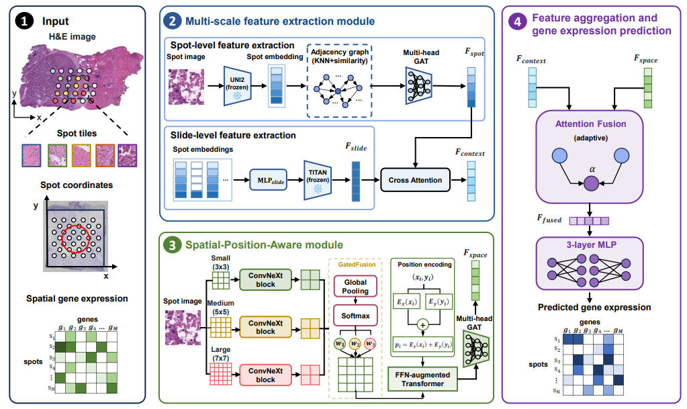

# VISTA: Virtual Spatial Transcriptomics from Histopathology

This is the official code repository for the paper: **Virtual spatial transcriptomics from histopathology enables prognostic and therapeutic response prediction in cancer**

## Overview of VISTA

Spatial transcriptomics reveals cellular heterogeneity, intercellular communication, and tissue organization, but its cost and limited accessibility restrict clinical use. Here, we present **VISTA**, a model that integrates multi-scale histological features and spatial context to infer spatial gene expression from H&E-stained tissue images. Across leave-one-section-out cross-validation and independent validation, VISTA robustly predicted thousands of genes and outperformed state-of-the-art methods. Beyond expression reconstruction, VISTA enabled clinically relevant downstream analyses. In TCGA breast cancer samples, it identified survival-associated genes, stratified prognostic risk groups, and revealed adverse tumor-associated spatial subtypes. In our in-house intrahepatic cholangiocarcinoma cohort, it preserved tumor–normal organization and identified *CLDN4* and *CYP3A4* as complementary spatial biomarkers. In HER2+ breast cancer, it predicted pathological response to neoadjuvant trastuzumab-based therapy and linked response-associated regions to immune and cytokine-related programs. These results support virtual spatial transcriptomics from routine histopathology for oncology applications.



## Tutorials

### Step 1 — TCGA SVS to JPEG Conversion

Convert Aperio `.svs` whole-slide images to JPEG thumbnails using OpenSlide. This step is only required for TCGA data.

**Notebook:** [`1_TCGA_SVS_to_JPEG_conversion.ipynb`](1_TCGA_SVS_to_JPEG_conversion.ipynb)

The script selects the second-lowest pyramid level (`level_count - 2`) to balance resolution and file size, then saves as quality-95 JPEG.

### Step 2 — Spot Filtering & Coordinate Recording

Sample tissue spots on a uniform grid and filter out white/background regions using RGB mean thresholds.

**Notebook:** [`2_TCGA_JPEG_patch_cropping.ipynb`](2_TCGA_JPEG_patch_cropping.ipynb)

Two strategies are provided: dense sliding window (stride = `patch_size`) and grid sampling (`grid_spacing = 50px`). The grid method produces a `_spots_coordinates.tsv` file per sample with columns `array_row`, `array_col`, `x`, `y`.

### Step 3 — Raw Patch Extraction

Extract raw RGB patches `[N, 3, H, W]` centered at each spot from the full-slide histology image. Covers 8 datasets: her2st, 10x Visium breast, TCGA-BRCA, Yale trastuzumab cohort, HCC, iCCA, Prostate, and Mouse Brain.

**Notebook:** [`3_raw_patch_extraction.ipynb`](3_raw_patch_extraction.ipynb)

Patch radii are either fixed (56px for her2st, 112px for TCGA/Yale) or computed dynamically from Visium scale factors (`spot_diameter_fullres`, `tissue_hires_scalef`). Output: `.pt` files of shape `[N_spots, 3, 2r, 2r]`.

### Step 4 — UNI2 Feature Extraction

Extract 1536-dimensional image features per spot using **UNI2** (ViT-Giant/14, ~1.8B parameters), a pathology foundation model pretrained on over 200 million H&E images. UNI2 is kept frozen during VISTA training.

**Notebook:** [`4_UNI2_feature_extraction.ipynb`](4_UNI2_feature_extraction.ipynb)

The `process_image_batch()` function crops spot-centered patches, resizes to 224×224, normalizes with ImageNet statistics, and runs GPU-batched inference through UNI2. Output: `.pt` files of shape `[N_spots, 1536]`.

### Step 5 — TITAN Slide-Level Encoding

Load **TITAN**, a whole-slide foundation model that aggregates patch features and spatial coordinates into a global slide-level embedding (768-dim). TITAN is kept frozen and called within the VISTA forward pass via `encode_slide_from_patch_features()`.

**Notebook:** [`5_TITAN_feature_extraction.ipynb`](5_TITAN_feature_extraction.ipynb)

### Step 6 — VISTA Model Training

Train the full VISTA architecture with leave-one-out cross-validation on the her2st breast cancer dataset.

**Notebook:** [`6_VISTA_model_training.ipynb`](6_VISTA_model_training.ipynb)

**Training details:** Loss = MSE + (1 − Pearson r), Adam optimizer (lr=1e-5), 1000 epochs, evaluation every 2 epochs. Best model saved by spot+gene PCC sum.

### Step 7 — Prediction

Load a trained VISTA checkpoint and predict spatial gene expression on a held-out test sample. Outputs predicted and ground-truth AnnData objects in `.h5ad` format.

**Notebook:** [`7_VISTA_prediction.ipynb`](7_VISTA_prediction.ipynb)

---

## Data Download

### Public Datasets

| Dataset | Source | Description |
|---------|--------|-------------|
| **HER2+ breast cancer (her2st)** | [https://github.com/almaan/her2st](https://github.com/almaan/her2st) | 32 tissue sections from 8 patients, used for LOO-CV |
| **10x Visium Human Breast Cancer (5 datasets)** | [10x Genomics Datasets](https://www.10xgenomics.com/datasets) | Independent validation across probe-based and whole-transcriptome chemistries |
| **TCGA-BRCA** | [TCGAbiolinks](https://bioconductor.org/packages/TCGAbiolinks) / [GDAC Firehose](http://gdac.broadinstitute.org/) | Diagnostic H&E slides + bulk RNA-seq |
| **Primary Liver Cancer (HCC/iCCA)** | [Wu et al., Science Advances](https://www.science.org/doi/10.1126/sciadv.abg3750) | Training set for liver cancer model |
| **HER2+ Trastuzumab Response** | [Yale Cohort](https://www.science.org/doi/10.1126/sciadv.abg3750) | H&E slides with pathological response labels |

### In-House Data

The iCCA spatial transcriptome dataset generated in this study is not publicly available due to institutional and ethical restrictions. Researchers may contact the corresponding author for academic access.

### Pretrained Model Weights

| Model | Source | Purpose |
|-------|--------|---------|
| **UNI2** | [HuggingFace / UNI2](https://huggingface.co/) | Spot-level feature extraction (ViT-Giant/14, frozen) |
| **TITAN** | [HuggingFace / TITAN](https://huggingface.co/) | Slide-level global encoding (frozen) |

Place model weights in the following structure:
```
VISTA/
├── UNI2.bin              # UNI2 pretrained weights
├── TITAN/                # TITAN model directory (from HuggingFace)
├── H0-mini/              # H0-mini weights
└── dinov2-small/         # DINOv2 ViT-Small weights
```

---

## Dependencies

```
python >= 3.10
torch >= 2.2, torchvision, timm
transformers >= 4.40, scanpy >= 1.9, anndata
openslide-python, scikit-image, Pillow
scikit-learn, scipy, pandas, numpy
tqdm, einops, h5py, matplotlib
```

---
